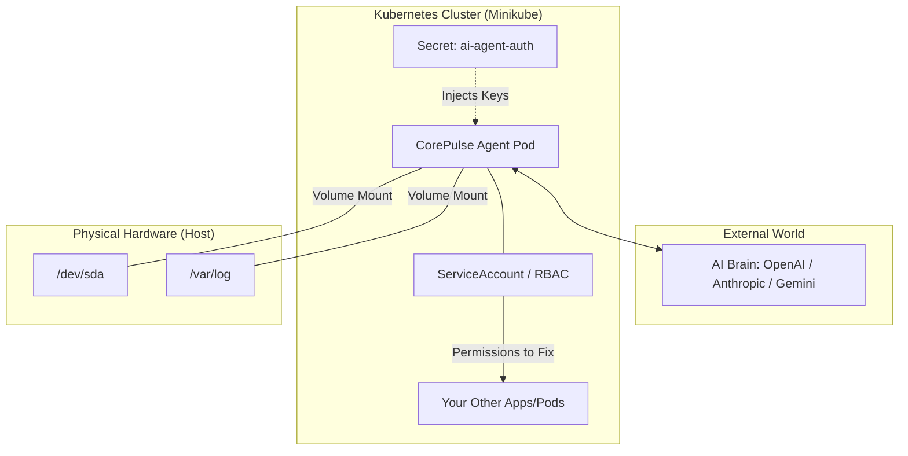

# ⚡ CorePulse AI Agent
**The AI-Powered SRE for your Kubernetes Homelab.**

CorePulse is a specialized Site Reliability Engineering (SRE) agent that uses advanced LLM reasoning to diagnose and solve server issues. Unlike traditional monitoring, CorePulse understands the relationship between **Physical Hardware**, **Network Latency**, and **Kubernetes Orchestration**.

---

## 🏗️ System Architecture

CorePulse runs as a privileged Pod with a `ServiceAccount` that allows it to act as an administrator within your cluster.



🧠 Diagnostic Logic Flow

CorePulse follows a "Hardware-First" deductive reasoning path to ensure we don't attempt to fix software when a disk is physically failing.

## 🚀 Quick Start

### 1️⃣ Security First (The Master Secret)

CorePulse is LLM-agnostic. Create a single secret containing all your potential API keys:

```bash
kubectl create secret generic ai-agent-auth \
  --from-literal=OPENAI_API_KEY='sk-...' \
  --from-literal=ANTHROPIC_API_KEY='sk-ant-...' \
  --from-literal=GEMINI_API_KEY='AIza...' \
  --save-config --dry-run=client -o yaml | kubectl apply -f -
```

### 2️⃣ Deploy Infrastructure

Apply the permissions and deployment:

```bash
# 1. Give the agent 'Administrator' eyes
kubectl apply -f rbac.yaml

# 2. Start the agent
kubectl apply -f deployment.yaml
```

### 3️⃣ Verify the "Brain"

Check the logs to see the agent performing its first system audit:

```bash
kubectl logs -f -l app=corepulse
```

## 🛠️ Project Structure

```
corepulse-agent/
├── app/
│   └── main.py          # AI Logic & Diagnostic Tools
├── Dockerfile           # Multi-tooling (smartmontools + Python)
├── requirements.txt     # Pydantic-AI & K8s Client
├── deployment.yaml      # K8s Deployment config
└── rbac.yaml            # Cluster Permissions
```

## ⚙️ Configuration

You can swap the "Brain" of the agent by changing the MODEL_PROVIDER environment variable in deployment.yaml:

- `openai` (default)
- `anthropic`
- `gemini`
- `ollama` (for local DeepSeek/Llama)
